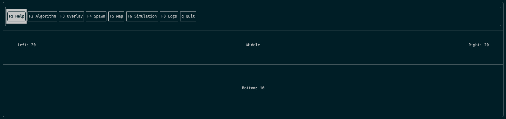

# Pathfinding Sandbox Demo [WIP]



A small sandbox project for experimenting with pathfinding and navigation systems in C++.

The project uses **CMake as the authoritative build system**, with a lightweight **Makefile providing developer convenience commands**.


# Requirements

- CMake ≥ 3.25
- Ninja
- C++20 compatible compiler
  - Apple Clang, Clang, or GCC
- clang-format (optional, for formatting)
- clang-tidy (optional, for static analysis)


# Build

```bash
git clone https://github.com/p-hebert/pathfinding-sandbox
cd pathfinding-sandbox

make configure
make build
```

This will:

1. Configure the project using the **CMake debug preset**
2. Generate the build system using **Ninja**
3. Compile the executable

CMake remains the **source of truth for the build configuration**.

The Makefile simply provides shortcuts for common tasks.


# Run

```bash
make run
```


# Run Tests

```bash
make test
```

Tests use GoogleTest and are integrated through CTest in the CMake configuration.


# Developer Commands

The repository includes a small **Makefile with convenience commands** for development workflows.

| Command          | Description                                        |
| ---------------- | -------------------------------------------------- |
| `make configure` | Configure the project using the CMake debug preset |
| `make build`     | Build the project                                  |
| `make run`       | Run the executable                                 |
| `make test`      | Run tests with CTest                               |
| `make format`    | Format source files with clang-format              |
| `make lint`      | Run clang-tidy static analysis                     |
| `make clean`     | Remove build artifacts                             |

Example:

```bash
make format
make lint
```


# Static Analysis

Static analysis is performed using **clang-tidy**.

```bash
make lint
```

clang-tidy runs using the project's `compile_commands.json` generated by CMake to ensure analysis matches the real build configuration.

# Code Formatting

Code formatting uses **clang-format**.

```bash
make format
```

Formatting rules are defined in `.clang-format`.


# Tooling

The project uses a modern C++ toolchain:

* **C++20**
* **CMake** build system
* **Ninja** build backend
* **clang-format** for code formatting
* **clang-tidy** for static analysis
* **CTest** for test execution


# Project Structure

```
src/
  main.cpp
```

```
build/
  debug/        # CMake build directory
```


# Notes

The Makefile is intentionally minimal and does **not replace CMake**.

All build configuration remains defined in:

```
CMakeLists.txt
CMakePresets.json
```

This keeps the project portable while still providing convenient developer workflows.

